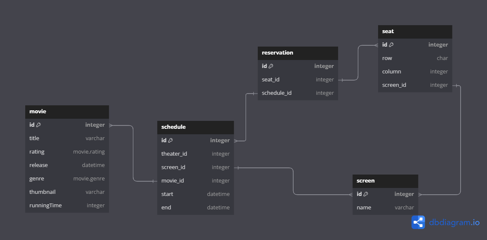

# Redis_project  

커머스의 핵심 프로세스인 상품 조회 및 주문 과정에서 발생할 수 있는 동시성 이슈 해결 및 성능 개선을 경험하고, 안정성을 높이기 위한 방법을 배웁니다.

## ERD (Entity-Relationship Diagram)



### 테이블 구성

 - movie: 영화의 기본정보
 - screen: 영화관의 상영관 정보
 - schedule: 상영관의 일정표
 - reservation: 영화예매 정보
 - seat: 좌석 정보

## 모듈 설계
```plaintext
├── module-api/
│   ├── movie/
│   │   ├── dto/
│   │   │   └── response/
│   │   └── service/
│   ├── reservation/
│   ├── schedule/
│   ├── screen/
│   └── seat/
│
├── module-domain/
│   ├── movie/
│   │   ├── entity/
│   │   ├── enums/
│   │   └── repository/
│   ├── reservation/
│   ├── schedule/
│   ├── screen/
│   └── seat/
│
├── module-common/
│   └── entity/
│
└── module-application/
    ├── CinemaApplication.java
    └── resources/
        ├── application.yml
        └── data.sql
```

### 모듈 구성 설명

#### module-api
 - 외부와 통신을 담당하는 interfaces 영역으로 분리
 - 컨트롤러, DTO, 서비스 인터페이스 및 구현체를 포함

#### module-domain

 - 비즈니스 핵심 도메인 모델, 엔티티 및 리포지토리 인터페이스를 정의
 - 외부 시스템에 대한 의존성이 최소화되도록 설계

#### module-common

 - 모든 모듈에서 공통으로 사용되는 유틸리티, 설정 및 기본 구성 요소를 포함
 - BaseEntity와 같은 공통 엔티티 클래스 제공

#### module-application

 - 애플리케이션 구동 및 설정을 담당
 - 메인 애플리케이션 클래스와 설정 파일 포함

## 아키텍쳐
 - 기본 적으로 layered architecture 로 구성.
 - 도메인 중심적인 관심사 분리를 위한 clean architecture 구성.