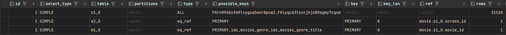
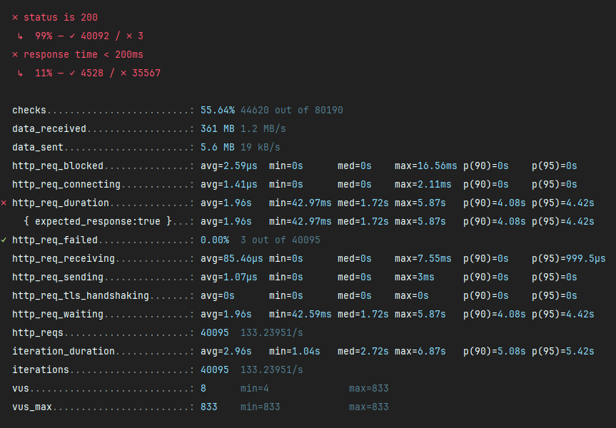
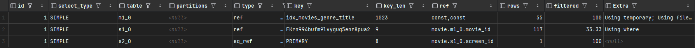
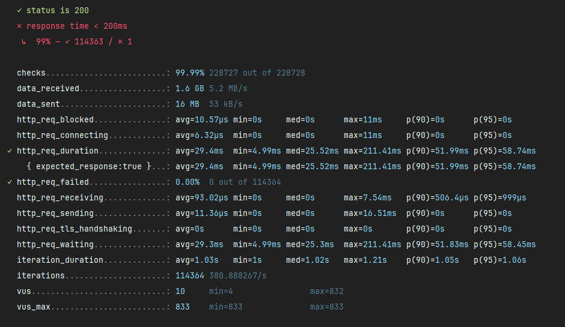
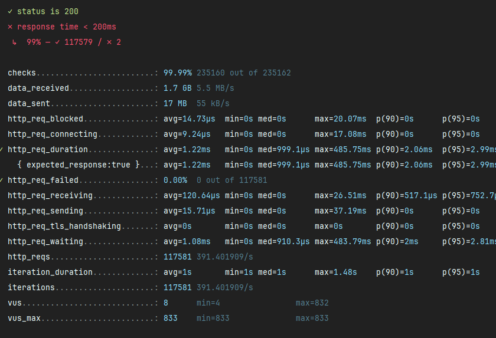
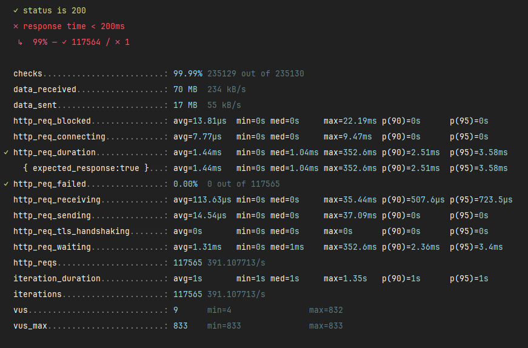

# Redis_project  

커머스의 핵심 프로세스인 상품 조회 및 주문 과정에서 발생할 수 있는 동시성 이슈 해결 및 성능 개선을 경험하고, 안정성을 높이기 위한 방법을 배웁니다.

## ERD (Entity-Relationship Diagram)


### 테이블 구성

 - movie: 영화의 기본정보
 - screen: 영화관의 상영관 정보
 - schedule: 상영관의 일정표
 - reservation: 영화예매 정보
 - seat: 좌석 정보

## 모듈 설계
```plaintext
├── module-api/
│   ├── movie/
│   │   ├── dto/
│   │   │   └── response/
│   │   └── service/
│   ├── reservation/
│   ├── schedule/
│   ├── screen/
│   └── seat/
│
├── module-domain/
│   ├── movie/
│   │   ├── entity/
│   │   ├── enums/
│   │   └── repository/
│   ├── reservation/
│   ├── schedule/
│   ├── screen/
│   └── seat/
│
├── module-common/
│   └── entity/
│
└── module-application/
    ├── CinemaApplication.java
    └── resources/
        ├── application.yml
        └── data.sql
```

### 모듈 구성 설명

#### module-api
 - 외부와 통신을 담당하는 interfaces 영역으로 분리
 - 컨트롤러, DTO, 서비스 인터페이스 및 구현체를 포함

#### module-domain

 - 비즈니스 핵심 도메인 모델, 엔티티 및 리포지토리 인터페이스를 정의
 - 외부 시스템에 대한 의존성이 최소화되도록 설계

#### module-common

 - 모든 모듈에서 공통으로 사용되는 유틸리티, 설정 및 기본 구성 요소를 포함
 - BaseEntity와 같은 공통 엔티티 클래스 제공

#### module-application

 - 애플리케이션 구동 및 설정을 담당
 - 메인 애플리케이션 클래스와 설정 파일 포함

## 아키텍쳐
 - 기본 적으로 layered architecture 로 구성.
 - 도메인 중심적인 관심사 분리를 위한 clean architecture 구성.

# 성능 테스트 보고서

## 전제 조건
- **DAU**: 100000명
- **1명당 1일 평균 접속 수**: 3번
- **피크 시간대의 집중률**: 평소 트래픽의 10배
- **Throughput 계산**:
    - **1일 총 접속 수** = DAU × 1명당 1일 평균 접속 수 = N × 2 = **2N** (1일 총 접속 수 : 1000000번)
    - **1일 평균 RPS** = 1일 총 접속 수 ÷ 86,400 (초/일)= 2N ÷ 86,400 ≈ **X** **RPS** (약 12번)
    - **1일 최대 RPS** = 1일 평균 RPS × (최대 트래픽 / 평소 트래픽)= X × 10 = **10X RPS** (약 120번)
- VU: 100000명
- optional
    - thresholds
        - e.g p(95) 의 응답 소요 시간 200ms 이하
        - 실패율 1% 이하

## DATA 갯수
- **Movies** : 500개
- **Schedules** : 976개
- **Screens** : 10개

## 1 - 인덱스 적용 전

### 쿼리 (실제로 동작하는 쿼리)

```sql
    select
        m1_0.movie_id,
        m1_0.created_at,
        m1_0.created_by,
        m1_0.genre,
        m1_0.rating,
        m1_0.release_date,
        m1_0.running_time,
        s1_0.movie_id,
        s1_0.schedule_id,
        s1_0.created_at,
        s1_0.created_by,
        s1_0.end,
        s2_0.id,
        s2_0.created_at,
        s2_0.created_by,
        s2_0.name,
        s2_0.updated_at,
        s2_0.updated_by,
        s1_0.start,
        s1_0.updated_at,
        s1_0.updated_by,
        m1_0.thumbnail,
        m1_0.title,
        m1_0.updated_at,
        m1_0.updated_by
    from
        movies m1_0
            join
        schedules s1_0
        on m1_0.movie_id=s1_0.movie_id
            left join
        screens s2_0
        on s2_0.id=s1_0.screen_id
    where
        m1_0.title=?
      and m1_0.genre=?
      and s1_0.start>?
    order by
        s1_0.start,
        m1_0.release_date desc
```

### 실행 계획


### 결과 스크린샷

### 부하 테스트 결과


| 측정 항목 | 측정치 |   
| --- | --- |
| **총 요청 수** | 40095 |
| **평균 요청 시간 (ms)** | 1960 |
| **최소 요청 시간 (ms)** | 42.97 |
| **최대 요청 시간 (ms)** | 5870 | 
| **초당 요청 처리량** | 133.2req/s |
| **데이터 송신 속도** | 19 kB/s | 
| **데이터 수신 속도** | 1.2 MB/s |

## 1 - 인덱스 적용 후

### 적용한 인덱스
 - 제목
 - 장르

### 쿼리
```sql
select
            m1_0.movie_id,
            m1_0.created_at,
            m1_0.created_by,
            m1_0.genre,
            m1_0.rating,
            m1_0.release_date,
            m1_0.running_time,
            s1_0.movie_id,
            s1_0.schedule_id,
            s1_0.created_at,
            s1_0.created_by,
            s1_0.end,
            s2_0.id,
            s2_0.created_at,
            s2_0.created_by,
            s2_0.name,
            s2_0.updated_at,
            s2_0.updated_by,
            s1_0.start,
            s1_0.updated_at,
            s1_0.updated_by,
            m1_0.thumbnail,
            m1_0.title,
            m1_0.updated_at,
            m1_0.updated_by 
        from
            movies m1_0 
        join
            schedules s1_0 
                on m1_0.movie_id=s1_0.movie_id 
        left join
            screens s2_0 
                on s2_0.id=s1_0.screen_id 
        where
            m1_0.title=? 
            and m1_0.genre=? 
            and s1_0.start>? 
        order by
            s1_0.start,
            m1_0.release_date desc
```

### 실행 계획


### 결과 스크린샷

### 부하 테스트 결과

| 측정 항목 | 측정치   | 증감수치 |
| --- |-------|------|
| **총 요청 수** | 114364 | +285% |
| **평균 요청 시간 (ms)** | 29.4  | -98.5% |
| **최소 요청 시간 (ms)** | 4.99  | -88.4% |
| **최대 요청 시간 (ms)** | 211.41 | -96.4% | 
| **초당 요청 처리량** | 381req/s | +186% |
| **데이터 송신 속도** | 53 kB/s | +179% |
| **데이터 수신 속도** | 5.2 MB/s | 333% |
```
      ✓ status is 200
     ✗ response time < 200ms
      ↳  99% — ✓ 114363 / ✗ 1
```

- 이전과는 비교 되지 않을 현저한 성과!
- 이래서 인덱스 인덱스 하는것임을 알게 되었음.

## 2 - 로컬 캐시 적용 후

### 캐싱 데이터 종류
 - 조인을 포함한 상영 정보에 필요한 전체 결과 캐싱
```java
@Override
    @Cacheable(cacheNames = "screeningCache", key = "#title + ':' + #genre")
    public List<MovieResponse> findAllMoviesIsShowing(FindAllRequest request) {
        List<Movie> movies = movieRepository.findAllWithSchedule(request.toFinds());
        return movies.stream().map(MovieResponse::of).toList();
    }
```
### 실행 계획
 - 이전과 동일

### 결과 스크린샷

### 부하 테스트 결과

| 측정 항목 | 측정치        | 증감수치         |
| --- |------------|--------------|
| **총 요청 수** | 117581     | +2.8%        |
| **평균 요청 시간 (ms)** | 1.22       | -98.9%       |
| **최소 요청 시간 (ms)** | 0          | N/A          |
| **최대 요청 시간 (ms)** | 485.75     | +129% (????) | 
| **초당 요청 처리량** | 391.4req/s | +2.7%        |
| **데이터 송신 속도** | 55 kB/s    | +3.8%        |
| **데이터 수신 속도** | 5.5 MB/s   | +3.8%        |
```
      ✓ status is 200
     ✗ response time < 200ms
      ↳  99% — ✓ 114363 / ✗ 1
```

- 미미한 변화였지만, 평균 요청시간에서 굉장한 발전을 보임.
- 아마 캐시에 담아두고 그 캐시를 가져다 쓰니 그런것 아닐까 추정중.

## 3 - 분산 캐싱 적용 후

### 캐싱 데이터 종류
- 로컬 캐시와 동일

### 실행 계획
- 이전과 동일

### 부하 테스트 결과 스크린샷

